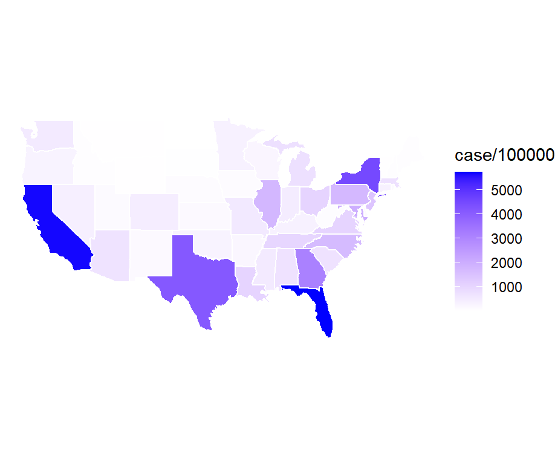
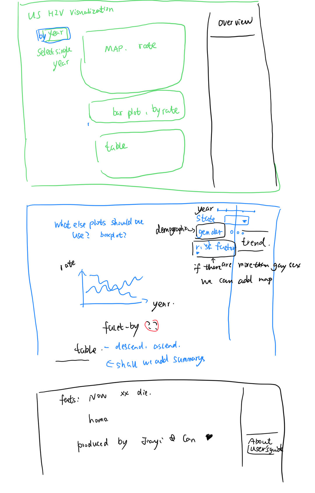

# Final Project Draft - Group MagnetIn

1.  A brief description of what (if any) modifications you have made to your product since submitting the app proposal on March 31.

    Our previous plan was to use a constantly updated dataset through an API, but then we realized that HIV datasets are typically updated on a yearly basis, and the data source we used, AtlasPlus, did not have an API available. So, now we choose to download the data from AtlasPlus and upload it to Github for use.

2.  What tasks do you need to complete before your product can run?

    Integration of data sets. Because the dataset is so large, we have to download small parts at a time and stitch them together.

    Draw plots to display the relationships or patterns among variables and tables to allow for easy reading, searching, and comparison of data points.

    Add app buttons to add the ability to create interactive elements in the Shiny app that allow users to provide input or trigger events.

    Choose colors and themes to help create effective, attractive, and meaningful visual representations of our data.

3.  Screenshots of your draft product

    

{width="849"}
